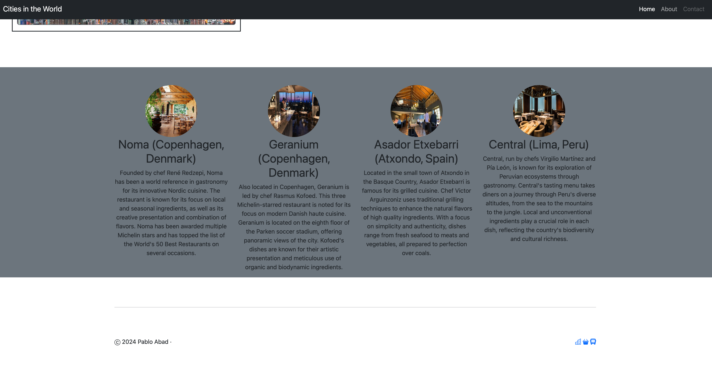

# Cities in the World

## Estado del Proyecto

🚧 **En Construcción** 🚧

Este proyecto está actualmente en desarrollo. Algunas características pueden no estar completas y pueden ocurrir cambios significativos en el código.




## Descripción

"Cities in the World" es una aplicación web que presenta información sobre diversas ciudades del mundo. Utiliza Bootstrap para el diseño y la maquetación, proporcionando una interfaz de usuario moderna y receptiva. Este proyecto es ideal para aprender y practicar el uso de frameworks CSS como Bootstrap, así como para explorar la integración de imágenes y contenido dinámico en una página web.

## Tecnologías Utilizadas

- **HTML5**: Para la estructura del contenido.
- **CSS3**: Para el diseño y la presentación visual.
- **Bootstrap 5.3.3**: Para el diseño responsivo y componentes UI.
- **JavaScript**: Para la interactividad y funcionalidad dinámica.
- **Sass**: Para la preprocesación de CSS.

## Estructura del Proyecto

```sh
.DS_Store .gitignore index.html package.json public/ .DS_Store assets/ .DS_Store fonts/ icons/ img/ .DS_Store logos/ pages/ scripts/ app.js styles/ style.css Readme.md src/ components/ sass/ services/ apis/ storage/ ts/
`````


## Instalación

Para instalar y configurar el proyecto, sigue estos pasos:

1. Clona el repositorio:

```sh
git clone https://github.com/PabloA1A/Cities-in-the-World.git
`````

2. Navega al directorio del proyecto:

```sh
cd Cities-in-the-World
`````

3. Instala las dependencias necesarias:

```sh
npm install
`````

## Uso

Para ejecutar la aplicación localmente, puedes abrir el archivo index.html en tu navegador o utilizar una extensión de servidor en vivo en tu editor de código.

## Contribuciones

Las contribuciones son bienvenidas. Si deseas contribuir, por favor sigue estos pasos:

1. Haz un fork del proyecto.
2. Crea una nueva rama (git checkout -b feature/nueva-funcionalidad).
3. Realiza tus cambios y haz commit (git commit -am 'Añadir nueva funcionalidad').
4. Sube tus cambios a la rama (git push origin feature/nueva-funcionalidad).
5. Abre un Pull Request.

## Licencia

Este proyecto está licenciado bajo la Licencia ISC. Consulta el archivo LICENSE para obtener más detalles.

## AUTHOR:

```sh
Pablo Abad
```